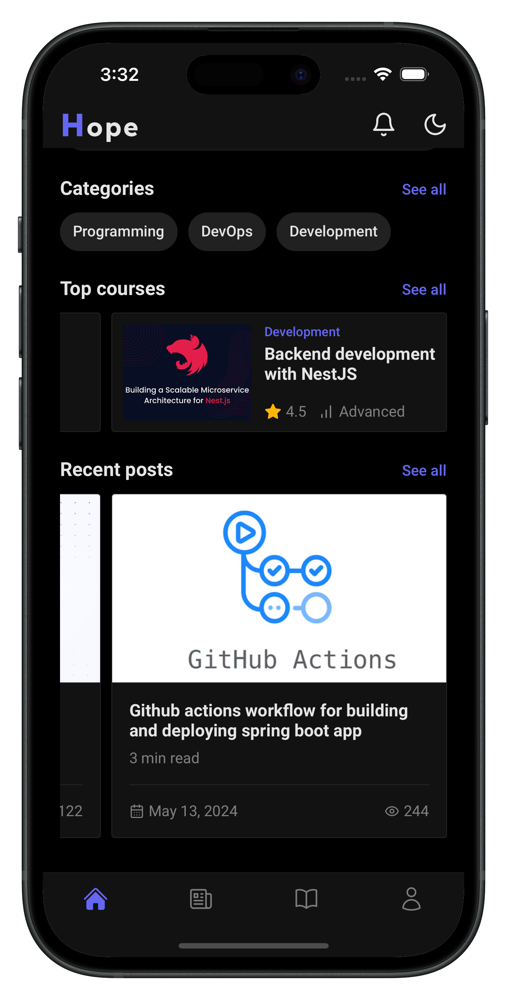
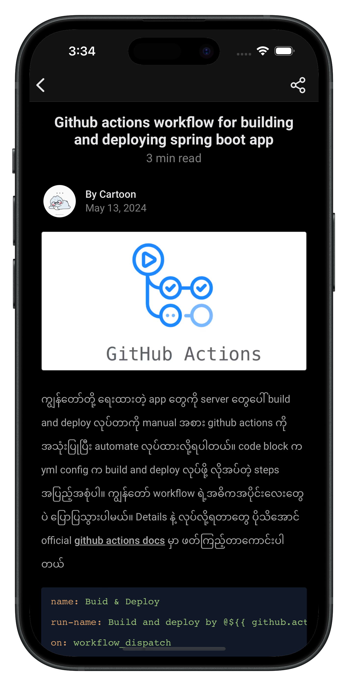
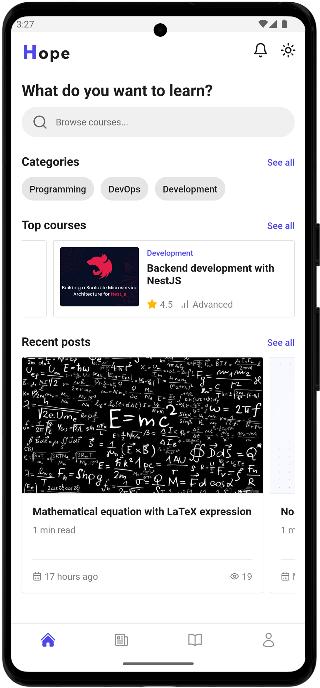
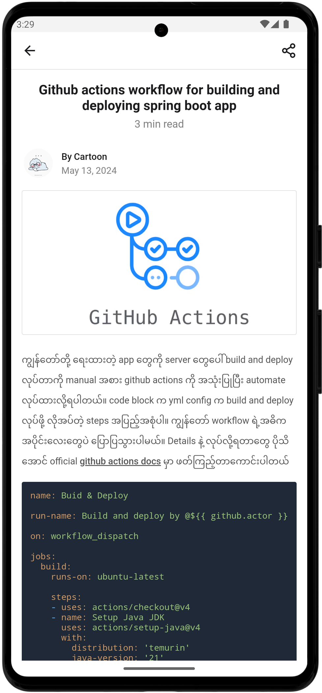

# Hope Elearning Mobile (On going)

E-learning mobile app project build with [**React Native**](https://reactnative.dev), bootstrapped using [`@react-native-community/cli`](https://github.com/react-native-community/cli).

**Features**:
<ul>
	<li>- [x] Course Management</li>
	<li>- [x] Blog Management</li>
	<li>- [x] Quiz Management</li>
	<li>- [x] Category</li>
	<li>- [x] Tag</li>
	<li>- [x] Course Bookmark</li>
	<li>- [x] Course Review</li>
	<li>- [x] User Management</li>
	<li>- [x] AI powered content editor</li>
	<li>- [x] Dark mode support</li>
	<li>- [ ] Subscription</li>
</ul>

This project is a mobile app part of [E-learning backend](https://github.com/phyohtetarkar/hope-elearning-backend/).

# Getting Started

>**Note**: Make sure you have completed the [React Native - Environment Setup](https://reactnative.dev/docs/environment-setup) instructions till "Creating a new application" step, before proceeding.

Required `.env` file properties.

```ini
API_URL= # backend api url
```

## Step 1: Start the Metro Server

First, you will need to start **Metro**, the JavaScript _bundler_ that ships _with_ React Native.

To start Metro, run the following command from the _root_ of your React Native project:

```bash
# using npm
npm start
```

## Step 2: Start your Application

Let Metro Bundler run in its _own_ terminal. Open a _new_ terminal from the _root_ of your React Native project. Run the following command to start your _Android_ or _iOS_ app:

### For Android

```bash
# using npm
npm run android
```

### For iOS

```bash
# using npm
npm run ios
```

If everything is set up _correctly_, you should see your new app running in your _Android Emulator_ or _iOS Simulator_ shortly provided you have set up your emulator/simulator correctly.

This is one way to run your app — you can also run it directly from within Android Studio and Xcode respectively.

## Support me

<a href="https://www.buymeacoffee.com/yzox2vc1i">
	
</a>
<br/>
<br/>

## Screenshots

<div float="left">
   
   
   
   
</div>

<div float="left">
   
   
   
</div>